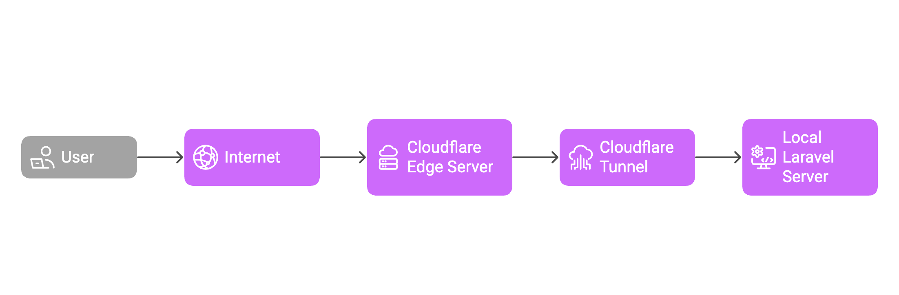
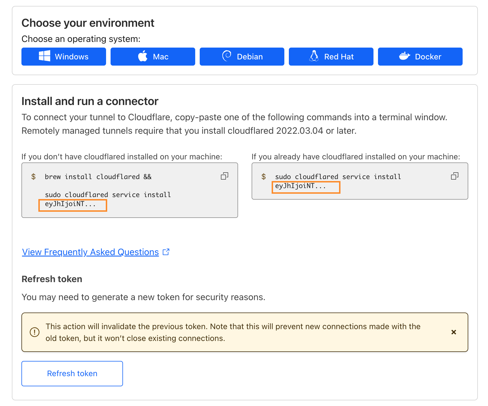
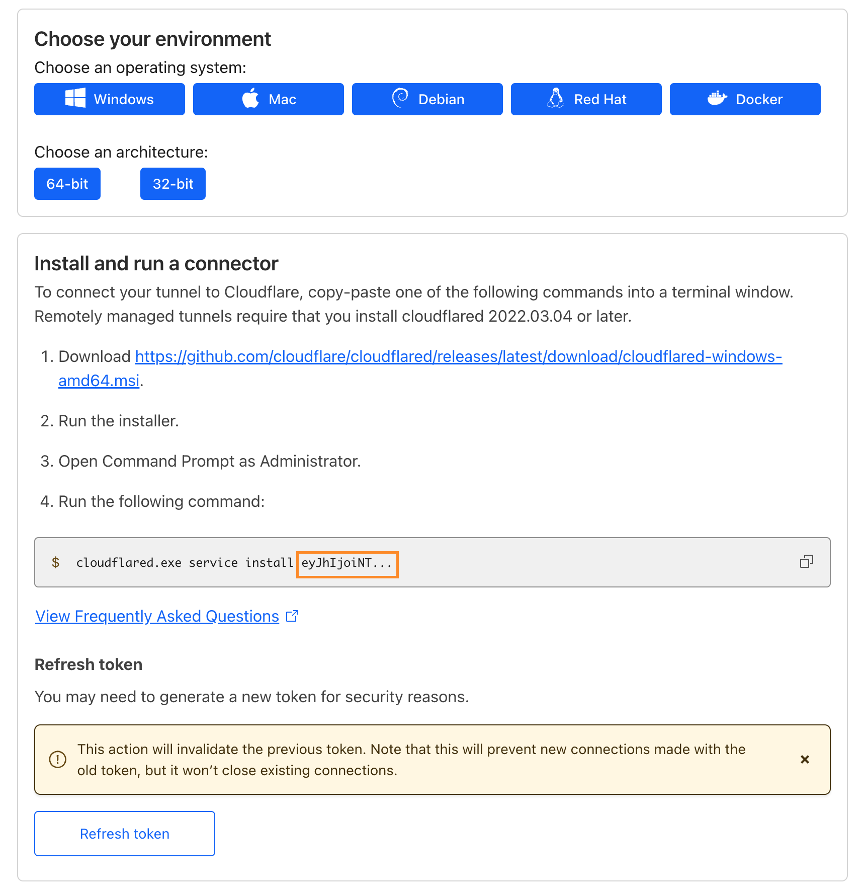

# Laravel + Cloudflare Tunnel



*Japanese description is available below / 日本語の説明は下部にあります*

## Overview

This project provides an environment for Laravel development locally and exposes it to the internet using Cloudflare Tunnel.

### Key Features

- Provides an environment for Laravel development locally
- Exposes your local environment to the internet using Cloudflare Tunnel
  - Useful for testing APIs that receive webhooks from external services

## Prerequisites

### Requirements

- Custom domain
  - You need to set up your domain on Cloudflare
- Cloudflare Tunnel token
  - You can obtain this from the Cloudflare dashboard

#### How to Get a Cloudflare Tunnel Token

**Mac**



**Windows**



## Installation

1. Clone this repository
   ```bash
   git clone <repository-url>
   cd laravel-cloudflared
   ```

2. Prepare the environment configuration file
   ```bash
   cp .env.example .env
   ```

3. Edit the `.env` file
   - Set `YOUR_CLOUDFLARE_TUNNEL_TOKEN` to your Cloudflare Tunnel token
   - Modify the DB settings as needed
     - **Warning**: The default settings are for Laravel Sail, but please change them appropriately for production environments

4. Install dependencies
   ```bash
   composer install
   ```

5. Generate application key
   ```bash
   php artisan key:generate
   ```

6. Start Docker containers
   ```bash
   # Using Laravel Sail
   ./vendor/bin/sail up -d
   
   # Or directly using Docker Compose
   docker compose up -d
   ```

7. Run database migrations
   ```bash
   php artisan migrate
   ```

8. Verification
   - Access `http://localhost` in your browser and confirm that the Laravel page is displayed correctly
   - Access your custom domain URL set up with Cloudflare Tunnel and confirm that the Laravel page is displayed correctly

## Tech Stack

- Laravel 12
- Docker / Laravel Sail
- Cloudflare Tunnel

## License

[MIT license](https://opensource.org/licenses/MIT)

---

# Laravel + Cloudflare Tunnel (日本語)

## 概要

このプロジェクトは、ローカルでのLaravel開発環境をCloudflare Tunnelを使用してインターネットに公開するための環境を提供します。

### 主な特徴

- ローカルでLaravelの開発を行うための環境を提供
- Cloudflare Tunnelを使用して、ローカル環境をインターネットに公開
  - 外部からwebhookを受けるAPIを提供してテストする場合に便利に使える

## 準備

### 必要なもの

- 独自ドメイン
  - Cloudflareで独自ドメインを設定する必要があります
- Cloudflare Tunnelのトークン
  - Cloudflareのダッシュボードから取得できます

#### Cloudflare Tunnelトークンの取得方法

**Mac**


**Windows**


## インストール方法

1. このリポジトリをクローンする
   ```bash
   git clone <repository-url>
   cd laravel-cloudflared
   ```

2. 環境設定ファイルを準備する
   ```bash
   cp .env.example .env
   ```

3. `.env`ファイルを編集する
   - `YOUR_CLOUDFLARE_TUNNEL_TOKEN`をCloudflare Tunnelのトークンに設定する
   - 必要に応じて、DBの設定を変更する
     - **警告**: sailを使う場合の設定をしてありますが、本番環境では適切に設定を変更してください

4. 依存関係をインストールする
   ```bash
   composer install
   ```

5. アプリケーションキーを生成する
   ```bash
   php artisan key:generate
   ```

6. Dockerコンテナを起動する
   ```bash
   # Laravel Sailを使用する場合
   ./vendor/bin/sail up -d
   
   # または、Docker Composeを直接使用する場合
   docker compose up -d
   ```

7. データベースのマイグレーションを実行する
   ```bash
   php artisan migrate
   ```

8. 動作確認
   - ブラウザで`http://localhost`にアクセスし、正しくLaravelのページが表示されることを確認する
   - ブラウザで、Cloudflare Tunnelで設定した独自ドメインのURLにアクセスし、正しくLaravelのページが表示されることを確認する

## 技術スタック

- Laravel 12
- Docker / Laravel Sail
- Cloudflare Tunnel

## ライセンス

[MIT license](https://opensource.org/licenses/MIT)
